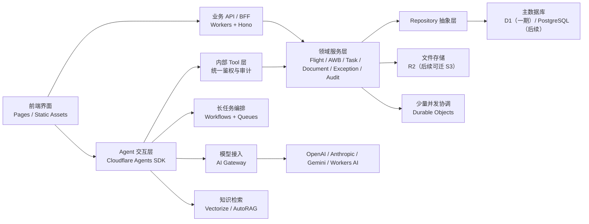

# Sinoport OS 技术架构 v1.0

## 1. 文档信息

- 文档版本：`v1.0`
- 文档状态：架构基线
- 更新时间：`2026-04-13`
- 适用阶段：后端一期启动前 / 客户验收后实现阶段
- 关联文档：
  - [Sinoport_OS_PRD_v1.0_开发版.md](/Users/lijun/Downloads/Sinoport/docs/Sinoport_OS_PRD_v1.0_开发版.md)
  - [Sinoport_OS_后端一期执行计划_v1.0.md](/Users/lijun/Downloads/Sinoport/docs/Sinoport_OS_后端一期执行计划_v1.0.md)
  - [Sinoport_OS_字段字典_v1.0.md](/Users/lijun/Downloads/Sinoport/docs/Sinoport_OS_字段字典_v1.0.md)
  - [Sinoport_OS_状态归属矩阵_v1.0.md](/Users/lijun/Downloads/Sinoport/docs/Sinoport_OS_状态归属矩阵_v1.0.md)
  - [Sinoport_OS_API_Contract_Draft_v1.0.md](/Users/lijun/Downloads/Sinoport/docs/Sinoport_OS_API_Contract_Draft_v1.0.md)
  - [Sinoport_OS_后续开发意见.md](/Users/lijun/Downloads/Sinoport/docs/Sinoport_OS_后续开发意见.md)

## 2. 文档目的

本文件用于收口 Sinoport 下一阶段的正式技术架构，目标不是讨论所有可选方案，而是冻结一套：

1. 当前能在 `Cloudflare` 免费层启动并完成样板站闭环的实现结构。
2. 客户验收通过后可以平滑升级到付费能力的运行结构。
3. 后续可以承接大量 `AI Agent` 集成的系统结构。
4. 保留未来迁移到 `AWS + PostgreSQL + S3` 的可迁移路径。

## 3. 架构目标

### 3.1 当前阶段目标

- 先让 `MME` 样板站形成真实后端闭环。
- 先承接 `Flight / AWB / Task / Document / Exception / Audit` 六类核心能力。
- 先保证权限、审计、状态推进、文件链四件事统一。
- 先支撑少量高价值 Agent，不追求一开始铺满全系统。

### 3.2 架构原则

1. 先满足 Cloudflare 低成本落地，再考虑更重的基础设施。
2. 业务真相与 Agent 运行时分离。
3. 所有正式读写都通过主系统 API / Tool 完成。
4. 数据访问层从第一天起保持可迁移。
5. Cloudflare 专属能力只用于适合它们的边界，不把核心业务写死在平台特性里。

## 4. 最终推荐结构



## 5. 各层职责

### 5.1 前端层

建议保留当前前端技术栈：

- `React`
- `Vite`
- `MUI`
- Cloudflare Pages 或 Workers Static Assets

职责：

- 页面展示
- 表单与交互
- 当前资源上下文传递
- Agent UI 嵌入

前端不直接访问数据库，也不直接访问对象存储内部接口。

### 5.2 API / BFF 层

推荐技术：

- `TypeScript`
- `Hono`
- `Cloudflare Workers`

选择原因：

- 与当前前端同语言，契约和枚举更容易复用。
- 对 Cloudflare 运行时适配最轻。
- 比传统 `NestJS` 更适合当前“边缘运行 + 低成本启动 + 后续可迁移”的目标。

职责：

- HTTP API 暴露
- 鉴权与权限入口
- DTO 校验
- Agent Tool 调用入口
- 返回体标准化

### 5.3 领域服务层

首批建议拆成以下领域服务：

- `AuthService`
- `FlightService`
- `ShipmentService`
- `TaskService`
- `DocumentService`
- `ExceptionService`
- `AuditService`
- `MobileTaskService`

职责：

- 封装业务规则
- 管理状态推进
- 触发审计记录
- 调用 Repository
- 协调文件与任务

领域服务不应直接感知 `D1`、`R2`、`Durable Objects` 的具体实现。

### 5.4 Repository 抽象层

这是可迁移的关键层。

要求：

- 先定义抽象接口，再写 `D1` 实现。
- 表结构、主键设计、索引思路优先贴近 `PostgreSQL`。
- 不大量依赖 SQLite / D1 特有语法。

建议接口：

- `FlightRepository`
- `ShipmentRepository`
- `TaskRepository`
- `DocumentRepository`
- `ExceptionRepository`
- `AuditRepository`
- `UserRepository`

### 5.5 主数据库层

一期推荐：

- `D1`

原因：

- 与 Workers 原生集成，适合当前 Cloudflare 免费层启动。
- 对一期样板站和内部验收规模足够。

后续演进：

- 当数据量、事务复杂度、多环境隔离、复杂报表要求提升时，迁移到 `PostgreSQL`。

数据库中应承载：

- 用户、角色、站点、班组、设备
- 航班、提单、任务、异常、单证元数据
- 状态推进记录
- 审计事件
- Agent 发起的动作记录

### 5.6 文件存储层

一期推荐：

- `R2`

职责：

- 存储 `NOA / POD / Manifest / 证据图片 / 扫描件 / 报文原件`

规则：

- 文件本体进 `R2`
- 文件元数据进数据库
- 不把大文件正文塞进主库

### 5.7 Agent 交互层

推荐：

- `Cloudflare Agents SDK`

定位：

- 它是系统的智能交互层，不是系统的主业务内核。
- 它可以深度嵌入业务界面，但不能直接成为主业务真相持有者。

适合放在 Agent 层的能力：

- 会话型问答
- 当前页面智能分析
- 智能建议
- 多轮上下文
- 少量实时协作

不适合直接放进 Agent 层的能力：

- 主业务数据持久化
- 核心事务写入
- 权限主判断
- 审计主账本

### 5.8 长任务编排层

推荐：

- `Workflows`
- `Queues`

适用场景：

- 批量单证解析
- 外部接口轮询
- 需等待人工审批的多步流程
- 导入任务与重试
- Agent 触发的后台长任务

原则：

- 实时交互留给 Agent
- 长任务交给 Workflow

### 5.9 并发协调层

推荐：

- 只在少量关键写入点使用 `Durable Objects`

适用场景：

- 同一航班状态推进串行化
- 同一任务接单 / 完成防并发冲突
- 导入任务单实例协调

不要把它当主数据库或通用缓存使用。

### 5.10 模型与知识层

推荐：

- 模型统一走 `AI Gateway`
- 检索统一走 `Vectorize` 或 `AutoRAG`

原因：

- 模型调用统一做日志、成本控制、限流、fallback。
- 知识检索与业务主库分离。

模型接入策略：

- 轻量实验或小模型任务可接 `Workers AI`
- 主模型优先接 `OpenAI / Anthropic / Gemini`
- 不把核心 Agent 完全绑定到单一模型供应商

## 6. 业务系统与 Agent 的边界

### 6.1 统一原则

对用户来说，Agent 是系统的一部分；对架构来说，Agent 是系统的智能操作层。

### 6.2 正确调用链

```txt
User -> UI -> Agent -> Internal Tool API -> AuthZ -> Domain Service -> Repository -> DB/R2
```

禁止调用链：

```txt
User -> Agent -> DB
```

### 6.3 上下文注入规则

只向 Agent 注入最小上下文：

- `user_id`
- `tenant_id`
- `station_id`
- `role_ids`
- 当前页面 `resource_type`
- 当前资源主键 `resource_id`

不直接把大量业务明细整体塞进 prompt。

### 6.4 Tool 调用规则

每个 Tool 独立做权限校验。

示例：

- `get_flight_context`
- `list_blocking_documents`
- `get_allowed_actions`
- `submit_exception_draft`
- `request_noa_send`

Agent 只能通过 Tool 读写业务能力。

## 7. 权限与审计设计

### 7.1 权限模型

权限分三层：

1. 用户权限
2. Agent 代理权限
3. Tool 级权限

规则：

- Agent 默认权限不得高于当前用户权限。
- Tool 每次执行都做二次鉴权。
- Agent 不能以系统管理员身份绕过主系统。

### 7.2 高风险动作

以下动作必须人工确认或二次鉴权：

- `NOA` 发送
- `POD` 替换
- 异常关闭
- 飞走确认
- 批量任务分派
- 单证放行

### 7.3 审计要求

所有正式写操作必须落审计：

- 发起人是谁
- Agent 是否参与建议
- 使用了哪个 Tool
- 输入输出摘要
- 最终是否成功
- 发生时间

## 8. 数据策略

### 8.1 一期数据真相

一期主业务真相放在 `D1`：

- `users`
- `roles`
- `stations`
- `flights`
- `shipments`
- `awbs`
- `tasks`
- `documents`
- `exceptions`
- `audit_events`
- `state_transitions`

### 8.2 可迁移约束

为了后续可切 `PostgreSQL`，从第一天起遵守：

1. 不把业务真相放进 `Durable Objects`
2. 不把 `KV` 当主数据库
3. 不把复杂状态机绑定到 Cloudflare 私有能力
4. SQL 风格尽量贴近 PostgreSQL 设计

### 8.3 文件策略

- 原件与证据全部走对象存储
- 数据库存引用、状态、归属、校验信息
- 上传链路和放行链路必须写审计

## 9. 一期推荐 Agent 清单

建议只先做 3 个高价值 Agent：

### 9.1 Station Copilot

用途：

- 回答当前站点运行态势
- 解释阻断原因
- 提示下一步动作

### 9.2 Exception Triage Agent

用途：

- 读取异常上下文
- 提供归因建议
- 给出恢复动作建议

### 9.3 Document Agent

用途：

- 识别单证类型
- 抽取关键字段
- 判断缺失项与阻断项

这些 Agent 都不能直接写主库，只能走 Tool。

## 10. 一期开发范围

一期只做样板站真实闭环，建议冻结以下模块：

1. `station/inbound/flights`
2. `station/inbound/waybills`
3. `station/documents`
4. `station/tasks`
5. `station/exceptions`
6. `mobile/tasks`

对应目标：

- 一票货从到港到交付能挂在统一对象链上
- 文件、任务、异常、状态、审计能贯通
- Agent 能基于真实数据给建议，但不直接越权执行

## 11. 建议目录结构

建议新增后端与 Agent 相关目录，形成以下结构：

```txt
admin-console/                 现有前端后台
docs/                          产品与技术文档
apps/
  api-worker/                  Hono + Workers API
  agent-worker/                Agent 入口与会话运行时
packages/
  contracts/                   DTO、枚举、接口 contract
  domain/                      领域服务与业务规则
  repositories/                Repository 抽象与 D1/Postgres 实现
  tools/                       Agent Tool 定义与执行器
  prompts/                     Prompt 模板与系统指令
  workflows/                   Workflow 与 Queue 任务定义
  auth/                        鉴权、权限、session、policy
infra/
  cloudflare/                  wrangler、D1、R2、Queue、Workflow 配置
  aws/                         后续迁移预留
```

说明：

- `admin-console` 先保留不动。
- 新后端从 `apps/api-worker` 开始搭建。
- Agent 和正式业务 API 分开部署，避免边界混乱。

## 12. 演进路径

### 12.1 当前阶段

- 以 Cloudflare 免费层完成样板站闭环
- 主库用 `D1`
- 文件用 `R2`
- Agent 先做少量高价值场景

### 12.2 客户验收后

- 升级到付费能力
- 增加 `Workflows / Queues / Vectorize` 使用量
- 扩展更多站点与更多 Agent

### 12.3 迁移到 AWS 时

原则上保留：

- 前端
- Hono API 层
- 领域服务层
- Tool 协议
- Prompt 与 Agent 业务逻辑

替换部分：

- `D1 -> PostgreSQL`
- `R2 -> S3`
- `Durable Objects / Workflows -> Redis + Queue + Worker`

## 13. 结论

Sinoport 下一阶段正式技术架构应收口为：

- `Cloudflare` 原生运行的业务 API 层
- 与业务系统深度集成、但不越权的 Agent 层
- 以 `D1 + R2` 为一期低成本落地基线
- 以 Repository 抽象保证后续切换 `PostgreSQL`
- 以 `Workflows + Queues + AI Gateway + Vectorize` 承接后续大量 Agent 需求

一句话定义：

`Cloudflare 原生业务系统 + 深度集成的 Agent 层 + 可迁移的数据访问层`

## 14. Cloudflare 官方参考

以下能力与额度以 Cloudflare 官方文档为准。本架构于 `2026-04-13` 参考了这些入口：

- [Workers Pricing](https://developers.cloudflare.com/workers/platform/pricing/)
- [Workers Limits](https://developers.cloudflare.com/workers/platform/limits/)
- [D1 Pricing](https://developers.cloudflare.com/d1/platform/pricing/)
- [R2 Pricing](https://developers.cloudflare.com/r2/pricing/)
- [Queues Pricing](https://developers.cloudflare.com/queues/platform/pricing/)
- [Workflows Pricing](https://developers.cloudflare.com/workflows/reference/pricing/)
- [Agents Overview](https://developers.cloudflare.com/agents/)
- [AI Gateway](https://developers.cloudflare.com/ai-gateway/)
- [Vectorize Pricing](https://developers.cloudflare.com/vectorize/platform/pricing/)
